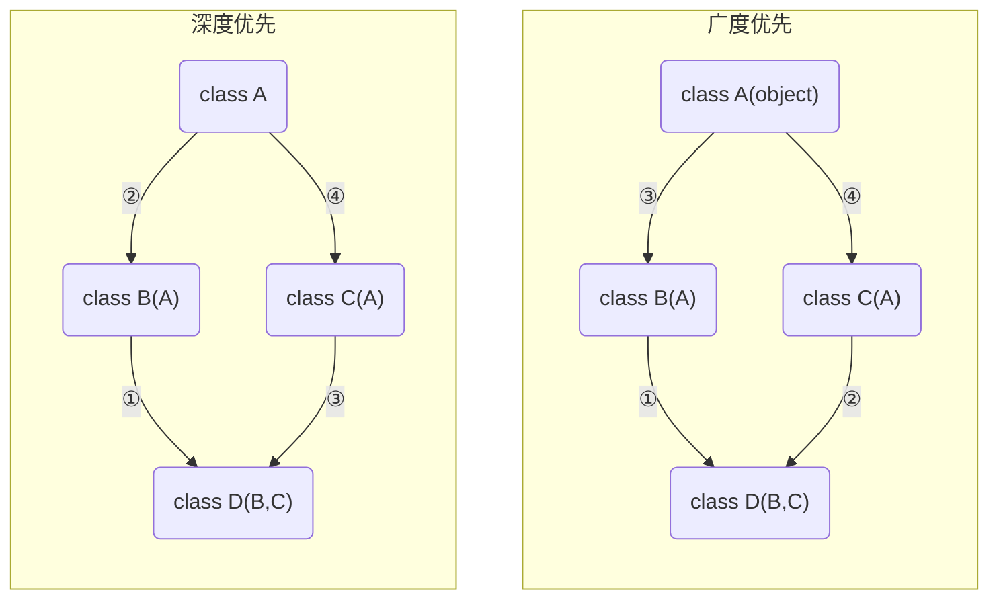

# 封装和继承

## 继承

```python
class ParentClass1: #定义父类
    pass

class ParentClass2: #定义父类
    pass

class SubClass1(ParentClass1): #单继承，基类是ParentClass1，派生类是SubClass
    pass

class SubClass2(ParentClass1,ParentClass2): #多继承，用逗号分隔开多个继承的类
    pass
```

### 判断是否是继承

```python
issubclass(sub, super)
```

python3.10+ 允许使用`|`分隔多个super

### 查看继承链

`__base__`只查看从左到右继承的第一个子类，`__bases__`则是查看所有继承的父类

```python
>>> SubClass1.__bases__ 
(<class '__main__.ParentClass1'>,)
>>> SubClass2.__bases__
(<class '__main__.ParentClass1'>, <class '__main__.ParentClass2'>)
```

如果没有指定基类，python的类会默认继承object类，object是所有python类的基类，它提供了一些常见方法

`__mro__` 相比 `__bases__` 返回值最前面会多出一个自己本身，最后面会多一个object类

### super类

在类内部实例化`super()`会顺着继承链返回后一个类的实例。    
由于多继承的关系，后一个类不一定是父类。    
在python2中类内部使用`super()`时，参数不可以不写    
不省略参数的写法是：`super(cls, self)`

### 派生属性和方法

子类也可以添加自己新的属性或者在自己这里重新定义这些属性（不会影响父类的属性）

::: tip 派生基本类
派生基本类时情况会比较特殊

比如str的初始化是在`__new__`中
:::

## 抽象类与接口类

> 继承有两种用途：    
> 一：继承基类的方法，并且做出自己的改变或者扩展（代码重用）  
> 二：声明某个子类兼容于某基类，定义一个接口类Interface，接口类中定义了一些接口名（就是函数名）且并未实现接口的功能，子类继承接口类，并且实现接口中的功能

python中没有专门的接口类 但是有抽象类。它们的区别是：

接口类的所有方法都是抽象方法，抽象类只需要存在抽象方法。

抽象类只能作为基类存在 不允许被实例化。

### **依赖倒置原则**

> 高层模块不应该依赖低层模块，二者都应该依赖其抽象；    
> 抽象不应该应该依赖细节；细节应该依赖抽象。    
> 换言之，要针对接口编程，而不是针对实现编程

接口继承实质上是要求“做出一个良好的抽象，这个抽象规定了一个兼容接口，使得外部调用者无需关心具体细节，可一视同仁的处理实现了特定接口的所有对象”——这在程序设计上，叫做归一化。

## 混入

另一种派生方法的方式：利用多继承的**Mixin方式**

```python
class A():
    pass
class foo_Mixin():
    def foo(self):
        pass
```

定义一个Mixin类里面写好需要派生的方法    
需要派生这个方法的类，只需要多继承一个Mixin类

```python
class B(foo_Mixin, A):
    pass
B().foo()
```

由于继承链的广度优先`foo_Mixin`里使用`super()`会往`A`指

### 钻石继承问题



它决定了属性查找的顺序即`super()`的指向，用`.mro()`或`__mro__`可以查看优先顺序

- 新式类：广度优先
- ~~经典类：深度优先~~

python3都是新式类，python2继承object才是新式类。

### 接口隔离原则

> 使用多个专门的接口，而不使用单一的总接口。    
> 即客户端不应该依赖那些不需要的接口。    
> 在继承抽象类的过程中，我们应该尽量避免多继承；     
> 而在继承接口的时候，我们反而鼓励你来多继承接口 

## 封装

隐藏对象的属性和实现细节，仅对外提供公共访问方式。     
在python中用双下划线开头的方式将属性隐藏起来（设置成私有的）

其实这仅仅这是一种变形操作
类中所有双下划线开头的名称如`__x`都会自动变形成：`_类名__x`的形式：

这种操作并不是严格意义上的限制外部访问，仅仅只是一种语法意义上的变形

```python
class A:
    __N=0
    def __init__(self):
        self.__X=10 #变形为self._A__X
    def __foo(self): #变形为_A__foo
        print('from A')
    def bar(self):
        self.__foo() #只有在类内部才可以通过__foo的形式访问到.
```

在继承中，父类如果不想让子类覆盖自己的方法，可以将方法定义为私有的

## 类内置装饰器

### property

```python
class People:
    def __init__(self,name,weight,height):
        self.name=name
        self.weight=weight
        self.height=height
    @property
    def bmi(self):
        return self.weight / (self.height**2)

p1=People('egon',75,1.85)
print(p1.bmi)
```

属性property，由其他已有属性值动态计算得到。    
本质就是实现了get，set，delete三种方法的数据描述符

```python
class Goods:
    def __init__(self):
        # 原价
        self.original_price = 100
        # 折扣
        self.discount = 0.8

    @property
    def price(self):
        # 实际价格 = 原价 * 折扣
        new_price = self.original_price * self.discount
        return new_price

    @price.setter
    def price(self, value):
        self.original_price = value

    @price.deleter
    def price(self):
        del self.original_price


obj = Goods()
obj.price         # 获取商品价格
obj.price = 200   # 修改商品原价
print(obj.price)
del obj.price     # 删除商品原价
```

### classmethod

（狭义上的）类方法，class命名空间里定义的只和类有关，不和实例有关的函数

```python
class Classmethod_Demo():
    role = 'dog'

    @classmethod
    def func(cls):
        print(cls.role)
Classmethod_Demo.func()
```

### staticmethod

静态方法，class命名空间里定义的普通函数，常用来定义工具函数。

```python
class Staticmethod_Demo():
    role = 'dog'

    @staticmethod
    def func():
        print("当普通方法用")

Staticmethod_Demo.func()
```

### typing.final

装饰一个类时，类不能被继承。

装饰一个方法时，这个方法不能被重写。