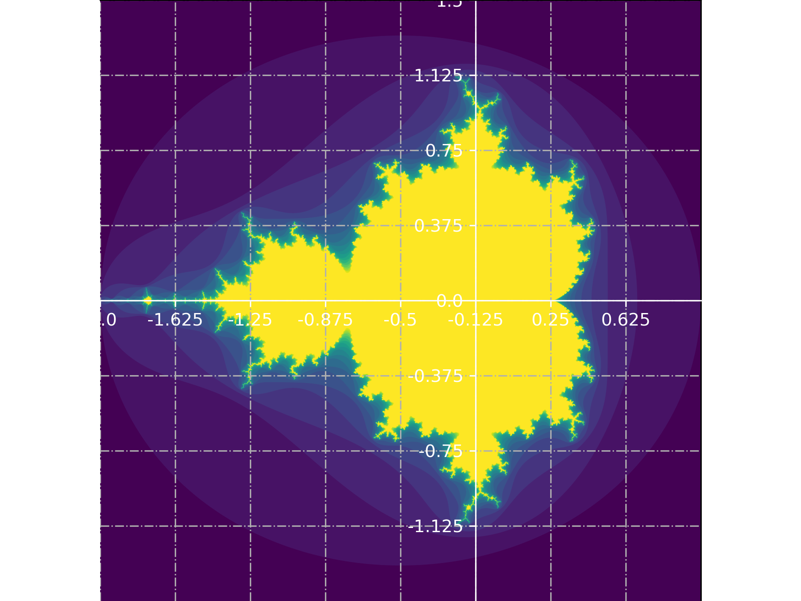

# 数学有关模块


## random模块

[random](https://docs.python.org/zh-cn/3/library/random.html#module-random)模块实现了各种分布的伪随机数生成器

```python
>>> import random
#随机小数
>>> random.random()      # 大于0且小于1之间的小数
0.7664338663654585
>>> random.uniform(1,3) #大于1小于3的小数
1.6270147180533838

#随机整数
>>> random.randint(1,5)  # 大于等于1且小于等于5之间的整数 左闭右闭
>>> random.randrange(1,10,2) # 大于等于1且小于10之间的奇数 左闭右开

#随机选择一个返回
>>> random.choice([1,'23',[4,5]])  # #1或者23或者[4,5]
#随机选择多个返回，返回的个数为函数的第二个参数
>>> random.sample([1,'23',[4,5]],2) # #列表元素任意2个组合
[[4, 5], '23']

#打乱列表顺序
>>> item=[1,3,5,7,9]
>>> random.shuffle(item) # 打乱次序
>>> item
[5, 1, 3, 7, 9]
>>> random.shuffle(item)
>>> item
[5, 9, 7, 1, 3]
```


## decimal模块

[decimal](https://docs.python.org/zh-cn/3/library/decimal.html#module-decimal)模块提供十进制数据类型，并能界定精度，由数字的字面量精准生成。

### 计算

```python
>>> 0.1 + 0.2
0.30000000000000004
>>> from decimal import *
>>> Decimal('0.1') + Decimal('0.2')
Decimal('0.3')
```


::: warning 运算符%
和普通浮点运算略有区别，Decimal对象是取余运算而不是取模运算
:::


使用数字字面量可以精准生成，也可以从数字生成，并来回转换

```python
>>> Decimal(0.3)
Decimal('0.299999999999999988897769753748434595763683319091796875')
>>> Decimal.from_float(0.3) #低版本python用
Decimal('0.299999999999999988897769753748434595763683319091796875')
>>> str(Decimal(0.3))
'0.299999999999999988897769753748434595763683319091796875'
>>> float(Decimal(0.3))
0.3
```

其他运算方法：

- `.sqrt()`    平方根
- `.exp()`    指数
- `.ln()`    自然对数
- `.log10()`    10 为底的对数


### 精度界定

`getcontext().prec`设置有效数字，默认有效数字为28位

```python
>>> getcontext().prec = 6
>>> Decimal(1) / Decimal(7)
Decimal('0.142857')
```

`getcontext().rounding`设置取舍方式，包括：

-  [`ROUND_CEILING`](https://docs.python.org/zh-cn/3/library/decimal.html#decimal.ROUND_CEILING)     向Infinity取舍
-  [`ROUND_DOWN`](https://docs.python.org/zh-cn/3/library/decimal.html#decimal.ROUND_DOWN)     向0取舍
-  [`ROUND_FLOOR`](https://docs.python.org/zh-cn/3/library/decimal.html#decimal.ROUND_FLOOR)     向-Infinity取舍
-  [`ROUND_HALF_DOWN`](https://docs.python.org/zh-cn/3/library/decimal.html#decimal.ROUND_HALF_DOWN)    半时向0取舍
-  [`ROUND_HALF_EVEN`](https://docs.python.org/zh-cn/3/library/decimal.html#decimal.ROUND_HALF_EVEN)     五舍六入    相当于内置函数`round()`
-  [`ROUND_HALF_UP`](https://docs.python.org/zh-cn/3/library/decimal.html#decimal.ROUND_HALF_UP)     半时向0反方向取舍
-  [`ROUND_UP`](https://docs.python.org/zh-cn/3/library/decimal.html#decimal.ROUND_UP)     向0反方向取舍
-  [`ROUND_05UP`](https://docs.python.org/zh-cn/3/library/decimal.html#decimal.ROUND_05UP)    界定后是05则是10 否则是00

`.quantize()`舍入为固定指数

```python
>>> Decimal('7.325').quantize(Decimal('.01'), rounding=ROUND_DOWN)
Decimal('7.32')
>>> Decimal('7.325').quantize(Decimal('1.'), rounding=ROUND_UP)
Decimal('8')
```


## math模块和cmath模块

[math](https://docs.python.org/zh-cn/3/library/math.html#module-math)模块提供了对C标准定义的数学函数的访问，不适用于复数。

如果想得到复数结果请使用[cmath](https://docs.python.org/zh-cn/3/library/cmath.html#module-cmath)模块的同名方法

### 常用数学常数

- *pi*    圆周率
- *e*    自然对数底数

### 常用数学函数

- `gcd`(*a*, *b*)    最大公约数
- `factorial`(*x*)    阶乘
- `sqrt`(*x*)    开平方
- `log`(*x*[, *base*])    对数
- `pow`(*x*, *y*)    指数
- `cos`(*x*)    三角
- `asin`(*x*)    反三角
- `degrees`(*x*)    `radians`(*x*)    角度弧度转化
- `ceil`(*x*)    `floor`(*x*)    上下取整

`canonical`(*x*)    返回相同的 Decimal 对象 *x*


## NumPy模块

第三方模块[NumPy](https://www.numpy.org.cn/alopecia/#预防脱发食物)是使用Python进行科学计算的基础包。除了数学函数，随机数它包含如下的内容：

- 一个强大的N维数组对象`.ndarray`
- 复杂的（广播）功能`.ufunc`
- 用于集成C / C ++和Fortran代码的工具
- 有用的线性代数`.linalg`，傅里叶变换`.fft` 

除了明显的科学用途外，NumPy还可以用作通用数据的高效多维容器。可以定义任意数据类型。这使NumPy能够无缝快速地与各种数据库集成。

### 绘制上帝指纹

```python
import numpy as np
import matplotlib.pyplot as plt


def mandelbrot(w, h=None, maxit=20):
    """Returns an image of the Mandelbrot fractal of size (h,w)."""
    if h is None:
        h = w
    y, x = np.ogrid[-1.5:1.5:h * 1j, -2:1:w * 1j]  #界定的复平面坐标系的横轴和纵轴
    c = x + y * 1j  #界定的复平面坐标系矩阵
    divtime = maxit + np.zeros(c.shape, dtype=int)  #初始化的权重矩阵
    z = c  #初始化的用于迭代的复平面坐标系矩阵z
    for i in range(maxit):
        z = z**2 + c  #mandelbrot集合迭代公式
        diverge = z * np.conj(z) > 2**2  #计算本轮发散的布尔索引
        div_now = diverge & (divtime == maxit)  #计算比上轮新增的布尔索引
        divtime[div_now] = i  #为新增的发散设置权重
        z[diverge] = 2  #为发散点的值赋值 简化后续运算
        '''
            这个值要大于根号2 如果不赋值 后续循环中将会溢出
            RuntimeWarning: overflow encountered in multiply
        '''
    return divtime

w = 1000
plt.imshow(mandelbrot(w))
ax = plt.gca()
ax.grid(True, linestyle='-.')
plt.yticks(np.mgrid[0:w:9j], np.mgrid[1.5:-1.5:9j])
plt.xticks(np.mgrid[0:w:9j], np.mgrid[-2:1:9j])
ax.spines['bottom'].set_position(('data', 1 / 2 * w))
ax.spines['left'].set_position(('data', 5 / 8 * w))
ax.spines['bottom'].set_color('white')
ax.spines['left'].set_color('white')
plt.tick_params(axis='x', colors='white')
plt.tick_params(axis='y', colors='white')
plt.show()
```

高清效果图



