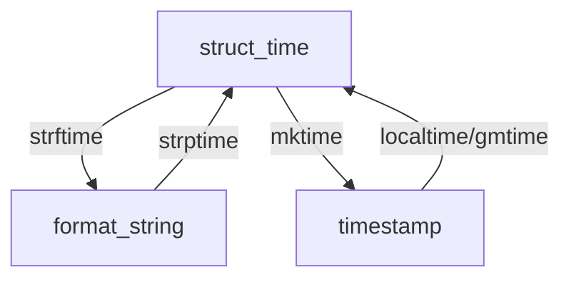

# 时间有关模块

## timeit 模块

[`timeit`](https://docs.python.org/zh-cn/3/library/timeit.html)模块提供简单的方法来计算一小段 Python 代码的耗时。简单使用如下

`timeit.timeit(eval/lambda, number=10000)` 运行 10000 次中的最快用时

```python
def test():
    pass

import timeit
print(timeit.timeit('test()', globals=globals()))
```

## time 模块

[`time`](https://docs.python.org/zh-cn/3/library/time.html)模块提供了各种时间相关的底层函数。最常用方法有：

- `time.sleep()` 线程睡眠，接收浮点秒数。
- `time.time()` 戳一个时间。

### 格式转换

在 Python 中，通常有这三种方式来表示时间

- 时间元组(struct_time)
- 时间戳(timestamp)
- 格式化时间(Format String)

#### timestamp

形如：`1588218207.4545252`

通常来说，时间戳表示的是从 1970 年 1 月 1 日 00:00:00 开始按秒计算的偏移量。

我们运行`time.time()`，返回的是当前时间戳，是 float 类型。

#### Format String

形如：`'2017-07-24 13:54:37'`

运行`time.strftime("%Y-%m-%d %H-%M-%S")`，返回当前格式化时间，参数中它支持以下指令

| 指令 | 意义                                                                                                                             |
| :--- | :------------------------------------------------------------------------------------------------------------------------------- |
| `%a` | 本地化的缩写星期中每日的名称。                                                                                                   |
| `%A` | 本地化的星期中每日的完整名称。                                                                                                   |
| `%b` | 本地化的月缩写名称。                                                                                                             |
| `%B` | 本地化的月完整名称。                                                                                                             |
| `%c` | 本地化的适当日期和时间表示。                                                                                                     |
| `%d` | 十进制数 [01,31] 表示的月中日。                                                                                                  |
| `%H` | 十进制数 [00,23] 表示的小时（24 小时制）。                                                                                       |
| `%I` | 十进制数 [01,12] 表示的小时（12 小时制）。                                                                                       |
| `%j` | 十进制数 [001,366] 表示的年中日。                                                                                                |
| `%m` | 十进制数 [01,12] 表示的月。                                                                                                      |
| `%M` | 十进制数 [00,59] 表示的分钟。                                                                                                    |
| `%p` | 本地化的 AM 或 PM 。                                                                                                             |
| `%S` | 十进制数 [00,61] 表示的秒。                                                                                                      |
| `%U` | 十进制数 [00,53] 表示的一年中的周数（星期日作为一周的第一天）。在第一个星期日之前的新年中的所有日子都被认为是在第 0 周。         |
| `%w` | 十进制数 [0(**星期日**),6] 表示的周中日。                                                                                        |
| `%W` | 十进制数 [00,53] 表示的一年中的周数（星期一作为一周的第一天）。在第一个星期一之前的新年中的所有日子被认为是在第 0 周。           |
| `%x` | 本地化的适当日期表示。                                                                                                           |
| `%X` | 本地化的适当时间表示。                                                                                                           |
| `%y` | 十进制数 [00,99] 表示的没有世纪的年份。                                                                                          |
| `%Y` | 十进制数表示的带世纪的年份。                                                                                                     |
| `%z` | 时区偏移以格式 +HHMM 或 -HHMM 形式的 UTC/GMT 的正或负时差指示，其中 H 表示十进制小时数字，M 表示小数分钟数字 [-23:59, +23:59] 。 |
| `%Z` | 时区名称（如果不存在时区，则不包含字符）。                                                                                       |
| `%%` | 字面的 `'%'` 字符。                                                                                                              |

#### struct_time

struct_time 元组共有 9 个元素共九个元素:(年，月，日，时，分，秒，一年中第几周，一年中第几天等）

| 索引（Index） | 属性（Attribute）         | 值（Values）              |
| ------------- | ------------------------- | ------------------------- |
| .             | tm_zone                   | 时区名称的缩写            |
| .             | tm_gmtoff                 | 以秒为单位的 UTC 以东偏离 |
| 0             | tm_year（年）             | 比如 2011                 |
| 1             | tm_mon（月）              | 1 - 12                    |
| 2             | tm_mday（日）             | 1 - 31                    |
| 3             | tm_hour（时）             | 0 - 23                    |
| 4             | tm_min（分）              | 0 - 59                    |
| 5             | tm_sec（秒）              | 0 - 61                    |
| 6             | tm_wday（星期几）         | 0 - 6 (星期一是 0 依次)   |
| 7             | tm_yday（一年中的第几天） | 1 - 366                   |
| 8             | tm_isdst（是否是夏令时）  | 默认为 0                  |

#### 当前时间的三种格式

```python
#导入时间模块
>>>import time

#时间戳
>>>time.time()
1500875844.800804

#时间字符串
>>>time.strftime("%Y-%m-%d %X")
'2017-07-24 13:54:37'
>>>time.strftime("%Y-%m-%d %H-%M-%S")
'2017-07-24 13-55-04'

#时间元组
#localtime将一个时间戳转换为当前时区的struct_time
>>>time.localtime()
time.struct_time(tm_year=2017, tm_mon=7, tm_mday=24,
　　　　　　　　　　tm_hour=13, tm_min=59, tm_sec=37,
                 tm_wday=0, tm_yday=205, tm_isdst=0)
```

#### 三种格式的转换



##### timestamp ⇄ struct_time

- `time.gmtime(timestamp) -> struct_time `
- `time.localtime(timestamp) -> struct_time `
- `time.mktime(struct_time) -> timestamp `

```python
#UTC时间。与英国伦敦当地时间一致
>>>time.gmtime(1500000000)
time.struct_time(tm_year=2017, tm_mon=7, tm_mday=14, tm_hour=2,
                 tm_min=40, tm_sec=0, tm_wday=4, tm_yday=195, tm_isdst=0)

#当地时间。北京与UTC时间相差+8小时
>>>time.localtime(1500000000)
time.struct_time(tm_year=2017, tm_mon=7, tm_mday=14, tm_hour=10,
                 tm_min=40, tm_sec=0, tm_wday=4, tm_yday=195, tm_isdst=0)
```

```python
#与time.localtime相反效果
>>>time_tuple = time.localtime(1500000000)
>>>time.mktime(time_tuple)
1500000000.0
```

##### struct_time ⇄ Format String

- `time.strftime(模板字符串, struct_time=当前) -> FormatString`
- `time.strptime(FormatString, 模板字符串) -> struct_time `

值得注意的是，在 Python3.8 之前，时间的模板字符串里不支持非 Ascii 字符。

```python
#结构化时间参数若不传，则显示当前时间
>>>time.strftime("%Y-%m-%d %X")
'2017-07-24 14:55:36'
>>>time.strftime("%Y-%m-%d",time.localtime(1500000000))
'2017-07-14'
```

```python
>>>time.strptime("2017-03-16","%Y-%m-%d")
time.struct_time(tm_year=2017, tm_mon=3, tm_mday=16, tm_hour=0,
                 tm_min=0, tm_sec=0, tm_wday=3, tm_yday=75, tm_isdst=-1)
>>>time.strptime("07/24/2017","%m/%d/%Y")
time.struct_time(tm_year=2017, tm_mon=7, tm_mday=24, tm_hour=0,
                 tm_min=0, tm_sec=0, tm_wday=0, tm_yday=205, tm_isdst=-1)
```

##### 与标准`%a %b %d %H:%M:%S %Y`格式的 Format String 之间的转换

- `time.asctime(struct_time) → Format %a %b %d %H:%M:%S %Y String`
- `time.ctime(timestamp) → Format %a %b %d %H:%M:%S %Y String`

```python
#如果不传参数，直接返回当前时间的格式化串
>>>time.asctime(time.localtime(1500000000))
'Fri Jul 14 10:40:00 2017'
>>>time.asctime()
'Mon Jul 24 15:18:33 2017'

#如果不传参数，直接返回当前时间的格式化串
>>>time.ctime()
'Mon Jul 24 15:19:07 2017'
>>>time.ctime(1500000000)
'Fri Jul 14 10:40:00 2017'
```

## calendar 模块

[`calendar`](https://docs.python.org/zh-cn/3/library/calendar.html)模块提供了日历相关的函数，和格式化输出日历。

常量

- `.MONDAY` = 0
- `.TUESDAY` = 1
- `.WEDNESDAY` = 2
- `.THURSDAY` = 3
- `.FRIDAY` = 4
- `SATURDAY` = 5
- `.SUNDAY` = 6

常用函数

- `.isleap`(_year_) 是否是闰年
- `.weekday`(_year_, _month_, _day_) 是星期几（星期一是 0 依次）
- `.weekheader`(_n_) 得到星期几的缩写头，n 是字符宽度
- `.monthrange`(_year_, _month_) 得到一个月第一天是星期几和这个月的天数
- `.timegm`(struct_time) 与`time.gmtime()`相反效果

常用类

- `.TextCalendar`(_firstweekday=0_) 简单文本日历
- `.HTMLCalendar`(_firstweekday=0_) 超文本日历

```python
>>> import calendar
#简单使用月历
>>> print(calendar.month(2021,4))
     April 2021
Mo Tu We Th Fr Sa Su
          1  2  3  4
 5  6  7  8  9 10 11
12 13 14 15 16 17 18
19 20 21 22 23 24 25
26 27 28 29 30

#本地化月历  前缀Locale-
#“ja-JP” 日语
#"fr-FR" 法语
#“zh-CN” 国语
#'en-US' 嘤语
>>> frc = calendar.LocaleTextCalendar(locale="fr-FR")
>>>  print(frc.formatmonth(2020, 4))
     avril 2020
lu ma me je ve sa di
       1  2  3  4  5
 6  7  8  9 10 11 12
13 14 15 16 17 18 19
20 21 22 23 24 25 26
27 28 29 30
# 如果需要星期日在第一位 需要设置firstweekday=6或者SUNDAY
```

注意：

- 本质调用`locale.setlocale()`，使用后会一直生效，且非线程安全。
- 由于等宽字体的限制，不推荐使用非字母的本地语言。
- 非字母的本地语言如果要使用，还需要调整`formatmonth`的`w`参数大于 2
- 如果出现乱码，可以尝试以下：
  - 重编码（推荐）
  - 加字符集，如`ja_JP.UTF-8` （低版本连接符为下划线）  
    （低版本可能需要捕获第一次 setlocale 的异常，python3.8 以上修复了）

## datetime 模块

[`datetime`](https://docs.python.org/zh-cn/3/library/datetime.html)模块提供用于处理日期和时间的类。

时间对象分为感知型和简单型，感知型相比简单型多了时区，夏令时等信息。

### 常用类

|   类名    |          功能说明           |
| :-------: | :-------------------------: |
| timedelta |         时间间隔类          |
|  tzinfo   |      感知型信息抽象类       |
| timezone  | tzinfo 类的子类，时区信息类 |
|   date    |        简单型日期类         |
|   time    |           时间类            |
| datetime  |  date 类的子类，日期时间类  |

实例化 timedelta 时间间隔类

```python
>>> import datetime
>>> jp_offset = datetime.timedelta(hours=9)
```

实例化 timezone 时区信息类

```python
>>> JST = datetime.timezone(jp_offset, name = 'Tokyo')
```

夏时制不深入讨论，需要实现抽象基类 tzinfo 上的`.dst()`方法，timezone 类并未将其实现。推荐第三方模块或者 python3.9+实现的[`zoneinfo`](https://docs.python.org/zh-cn/3.9/library/zoneinfo.html#module-zoneinfo) 模块（这是一个基于系统时区数据的实体 [`datetime.tzinfo`](https://docs.python.org/zh-cn/3.9/library/datetime.html#datetime.tzinfo) 实现）

### date 类

代表一个理想化历法中的日期（年、月和日），即当今的格列高利历向前后两个方向无限延伸

它是一个不可变类型（hashable）

#### 实例化生成

```python
import datetime
a = datetime.date(2017, 3, 15)
```

#### 静态方法生成

- `datetime.date.today`() 返回本地日期 date 对象
- `datetime.date.fromisoformat`(_date_string_) 格式化字符串 → 本地日期 date 对象，只支持`YYYY-MM-DD`
- `datetime.date.fromtimestamp`(_timestamp_) 时间戳 → 本地日期 date 对象

#### 对象属性和方法

- `.year`, `.month`, `.day` 数据描述符（只读）

```python
>>> b = datetime.date.today()
>>> b
datetime.date(2017, 3, 22)
>>> b.year
2017
>>> b.month
3
>>> b.day
22
```

- `.replace()` 替换数据描述符的属性值

```python
>>> a.replace(day=26)
datetime.date(2017, 3, 26)
```

- `.timetuple()` 转 struct_time 元组，补 0
- `.weekday()` 星期几 星期一为 0 依次
- `.isoweekday()` 星期几 没有 0，星期一为 1 依次
- `.isocalendar()` 返回元组`(年, 周，星期)` 星期规则同`.isoweekday()`

##### 比较和做差

由于实现了诸多魔术方法，两个 date 对象之间可以比较和做差

做差将返回 datetime.timedelta 对象

```python
>>> b < a
False
>>> b - a
datetime.timedelta(days=7)
>>> (b - a).days
7
```

##### 格式化输出

- `.strftime(模板字符串)` 格式化方法

- `.isoformat()` 返回符合 ISO 8601 标准但截断 (`yyyy-MM-dd`) 的日期字符串

- 魔术方法`__str__()`和`.__format__()` 可以使用格式化的一切方法。

```python
>>> b.__format__('%Y-%m-%d')
'2017-03-22'
>>> b.isoformat()
'2017-03-22'
>>> b.strftime('%y')
'17'
>>> format(b,'%D')
'03/22/17'
>>> str(b)
'2017-03-22'
```

### time 类

一个 time 对象代表某日的（本地）时间，它独立于任何特定日期，并可通过 tzinfo 对象来调整。

#### 实例化生成

`datetime.time`(_hour=0_, _minute=0_, _second=0_, _microsecond=0_, _tzinfo=None_)

#### 静态方法生成

`datetime.time.fromisoformat`(_time_string_) `.isoformat`的逆操作

#### 对象属性和方法

和 date 对象一样，实例化时的参数将成为实例对象的数据描述符（只读）

`.replace()` 替换数据描述符的属性值

##### 比较和做差运算

time 对象不能做差，比较的时候要求 tzinfo 属性一致。

##### 格式化输出

- `.strftime(模板字符串)` 格式化方法

- `.isoformat`(_timespec='auto'_) 返回符合 ISO 8601 标准 (`HH:mm:ss.ffffff`) 的时间字符串

  默认的`auto`会在`.ffffff`为`.000000`的时候不显示，即整秒时为`HH:mm:ss`

  可设置的其他值：

  - `'hours'`: 以两个数码的 `HH` 格式
  - `'minutes'`: 以 `HH:mm` 格式
  - `'seconds'`: 以 `HH:mm:ss` 格式
  - `'milliseconds'`: 包含完整时间，但将秒值截断至微秒（三位）
  - `'microseconds'`: 以 `HH:mm:ss.ffffff` 格式包含完整时间。

- 魔术方法`__str__()`, `__format__()`

```python
>>> offset = datetime.timedelta(hours=8)
>>> shanghai_timez = datetime.timezone(offset, name = 'Shanghai')
>>> bonjour = datetime.time(7,30,tzinfo=shanghai_timez)
>>> bonjour.isoformat()
'07:30:00+08:00'
>>> bonjour.strftime("%H:%M:%S %Z")
'07:30:00 Shanghai'
>>> format(bonjour,'与格林尼治时间相差%z小时')
'与格林尼治时间相差+0800小时'
```

### datetime 类

datetime 类可以看做是 date 类和 time 类的合体

由于是继承的 date 类，这里**只介绍派生的方法**。

#### 实例化生成

`datetime.datetime(year, month, day, hour, minute, second, microsecond,tzinfo)`

#### 静态方法生成

- `datetime.datetime.now`(_tz=None_) 当前的 datetime 对象，可传入时区，默认系统时区
- `datetime.datetime.utcnow`() 生成简单型 datetime 对象，消除时区信息
- `datetime.datetime.utcfromtimestamp`(_timestamp_) 由*timestamp*生成 datetime 对象，消除时区信息
- `datetime.datetime.combine`(_date_, _time_[, *tzinfo*]) 由 date 对象和 time 对象生成
- `datetime.datetime.strptime`(_date_string_, _format_) 由 date_string 生成 datetime 对象

```python
>>> datetime.datetime.strptime('2017-3-22 15:25','%Y-%m-%d %H:%M')
datetime.datetime(2017, 3, 22, 15, 25)
```

::: warning ISO8601
`datetime.datetime.fromisoformat`(_datetime_string_)  
只支持如`2020-11-11T09:36:27+00:00` 不支持 `2020-11-11T09:36:27Z`
:::

#### 对象属性和方法

- `.date()` 拆解出 date 对象
- `.time()` 拆解出 time 对象
- `.timestamp()` 6 位浮点的时间戳
- `.utctimetuple()` 返回消除时区信息的 struct_time

##### 格式化输出

`.isoformat`(_sep='T', timespec='auto'_) 同 date 类的同名方法，sep 是日期和时间之间的分隔符。

#### 时区转换

- `.astimezone(tz)` 偏移时间
- `.replace(tzinfo=` 转换时区

```python
# 时间戳转utc
d = datetime.datetime.utcfromtimestamp(1454060831)
# 2016-01-29 09:47:11

# 转上海时间（上面已经定义了shanghai_timez）
d1 = d.replace(tzinfo=datetime.timezone.utc).astimezone(shanghai_timez)
# 2016-01-29 17:47:11+08:00
```

也可以简单点：

```python
d1 = d + datetime.timedelta(hours=8)
```
