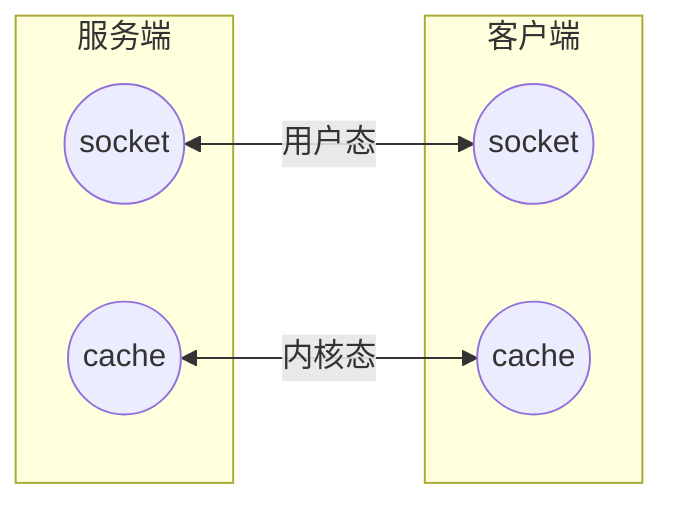

# 套接字 socket

> 套接字起源于 20 世纪 70 年代加利福尼亚大学伯克利分校版本的 Unix,即人们所说的 BSD Unix。 因此,有时人们也把套接字称为“伯克利套接字”或“BSD 套接字”。一开始,套接字被设计用在同 一台主机上多个应用程序之间的通讯。这也被称进程间通讯或 IPC。

## socket 模块

[`socket`](https://docs.python.org/zh-cn/3/library/socket.html)模块提供了访问 BSD 套接字的接口

### 创建套接字

```python
import socket
s = socket.socket()
```

#### 参数

- AF_INET 面向网络的套接字（默认种族）
- AF_UNIX 基于文件的套接字
- TCP 套接字的名 SOCK_STREAM（默认类型）
- UDP 套接字的名 SOCK_DGRAM

| 常用方法          |                                                           |
| ----------------- | --------------------------------------------------------- |
| `s.bind()`        | 绑定(主机,端口号)到套接字                                 |
| `s.listen()`      | 开始 TCP 监听                                             |
| `s.accept()`      | 被动接受 TCP 客户的连接,(阻塞式)等待连接的到来            |
| `s.connect()`     | 主动初始化 TCP 服务器连接                                 |
| `s.connect_ex()`  | `connect()`函数的扩展版本,出错时返回出错码,而不是抛出异常 |
| `s.recv()`        | #接收 TCP 数据                                            |
| `s.send()`        | #发送 TCP 数据                                            |
| `s.sendall()`     | #发送 TCP 数据                                            |
| `s.recvfrom()`    | #接收 UDP 数据                                            |
| `s.sendto()`      | #发送 UDP 数据                                            |
| `s.getpeername()` | #连接到当前套接字的远端的地址                             |
| `s.getsockname()` | #当前套接字的地址                                         |
| `s.getsockopt()`  | #返回指定套接字的参数                                     |
| `s.setsockopt()`  | #设置指定套接字的参数                                     |
| `s.close()`       | #关闭套接字，也支持 with 上下文管理`socket.socket()`      |

### 基于 TCP 协议的 socket

#### server 端

```python
import socket
sk = socket.socket() #即socket.socket(socket.AF_INET,socket.SOCK_STREAM)
sk.bind(('127.0.0.1',8898))  #把地址绑定到套接字
sk.listen()          #监听链接
conn,addr = sk.accept() #接受客户端链接 会和input一样一直等待连接
ret = conn.recv(1024)  #接收客户端信息 会和input一样一直等待着信
print(ret)       #打印客户端信息
conn.send(b'hi')        #向客户端发送信息
conn.close()       #关闭客户端套接字
sk.close()        #关闭服务器套接字(可选)
```

#### client 端

```python
import socket
sk = socket.socket() # 创建客户套接字
sk.connect(('127.0.0.1',8898))    # 尝试连接服务器
sk.send(b'hello!')
ret = sk.recv(1024)         # 对话(发送/接收)
print(ret)
sk.close()            # 关闭客户套接字
```

### 常见报错

::: danger Traceback(most recent call last):
OSError: [Error 48] Address already in use
:::

解决方法： 加入一条 socket 配置，重用 ip 和端口

```python
import socket
from socket import SOL_SOCKET,SO_REUSEADDR
sk = socket.socket()
sk.setsockopt(SOL_SOCKET,SO_REUSEADDR,1) #就是它，在bind前加
sk.bind(('127.0.0.1',8898))
sk.listen()
```

::: danger Traceback(most recent call last):
ConnectionRefusedError: [WinError 10061] 由于目标计算机积极拒绝，无法连接。
:::

解决方法： 修改防火墙设置或者换一个端口号

### 基于 UDP 协议的 socket

udp 无需监听和建立连接。

udp 收发消息会分别接收和发送对方的地址（addr）。

#### server 端

```python
import socket
udp_sk = socket.socket(type=socket.SOCK_DGRAM)   #创建一个服务器的套接字
udp_sk.bind(('127.0.0.1',9000))        #绑定服务器套接字
msg,addr = udp_sk.recvfrom(1024)
print(msg)
udp_sk.sendto(b'hi',addr)                 # 对话(接收与发送)
udp_sk.close()                         # 关闭服务器套接字
```

#### client 端

```python
import socket
ip_port=('127.0.0.1',9000)
udp_sk=socket.socket(type=socket.SOCK_DGRAM)
udp_sk.sendto(b'hello',ip_port)
back_msg,addr=udp_sk.recvfrom(1024)
print(back_msg.decode('utf-8'),addr)
```

### 更多方法介绍

- 面向锁

  | `s.setblocking()` | 设置套接字的阻塞与非阻塞模式 |
  | ----------------- | ---------------------------- |
  | `s.settimeout()`  | 设置阻塞套接字操作的超时时间 |
  | `s.gettimeout()`  | 得到阻塞套接字操作的超时时间 |

- 面向文件

  | `s.fileno()`   | 套接字的文件描述符           |
  | -------------- | ---------------------------- |
  | `s.makefile()` | 创建一个与该套接字相关的文件 |

官方文档对 socket 模块下的`socket.send()`和`socket.sendall()`解释如下：

```python
socket.send(string[, flags]):
'''Send data to the socket. The socket must be connected to a remote socket.
The optional flags argument has the same meaning as for recv() above.
Returns the number of bytes sent.
Applications are responsible for checking that all data has been sent;
if only some of the data was transmitted,
the application needs to attempt delivery of the remaining data.
send()的返回值是发送的字节数量，这个数量值可能小于要发送的string的字节数，
也就是说可能无法发送string中所有的数据。如果有错误则会抛出异常。'''
    pass

socket.sendall(string[, flags]):
'''Send data to the socket.
The socket must be connected to a remote socket.
The optional flags argument has the same meaning as for recv() above.
Unlike send(), this method continues to send data
from string until either all data has been sent or an error occurs.
None is returned on success.
On error, an exception is raised,
and there is no way to determine how much data,
if any, was successfully sent.
尝试发送string的所有数据，成功则返回None，失败则抛出异常。
故，下面两段代码是等价的：'''
#sock.sendall('Hello world\n')
#buffer = 'Hello world\n'
#while buffer:
#    bytes = sock.send(buffer)
#    buffer = buffer[bytes:]
    pass
```

## socketserver 模块

[`socketserver`](https://docs.python.org/zh-cn/3/library/socketserver.html)模块使一个 server 端可以同时和多个 client 端连接（多线程)

与只使用 socket 时`conn,addr = sk.accept()`相同的是  
继承`socketserver.BaseRequestHandler`之后  
`self.request` 就相当于 conn  
`self.client_address` 就相当于 addr

### server 端

```python
import socketserver

class Myserver(socketserver.BaseRequestHandler):
    def handle(self):
        self.data = self.request.recv(1024).strip()
        print("{} wrote:".format(self.client_address[0]))
        print(self.data)
        self.request.sendall(self.data.upper())

if __name__ == "__main__":
    HOST, PORT = "127.0.0.1", 9999
    # 设置allow_reuse_address允许服务器重用地址
    socketserver.TCPServer.allow_reuse_address = True
    # 创建一个server, 将服务地址绑定到127.0.0.1:9999
    server = socketserver.TCPServer((HOST, PORT),Myserver)
    # 让server永远运行下去，除非强制停止程序
    server.serve_forever()
```

### client 端

就是最前面的基于 TCP 的套接字的 C 端，这里使用 with 上下文管理的写法

```python
import socket

HOST, PORT = "127.0.0.1", 9999
data = "hello"

with socket.socket(socket.AF_INET, socket.SOCK_STREAM) as sock:
    sock.connect((HOST, PORT))
    sock.sendall(bytes(data + "\n", "utf-8"))
    received = str(sock.recv(1024), "utf-8")

print("Sent:     {}".format(data))
print("Received: {}".format(received))
```

## 黏包

现象 : 同时执行多条命令之后，得到的结果很可能只有一部分，在执行其他命令的时候又接收到之前执行的另外一部分结果，这种显现就是黏包。

### 黏包成因

- TCP 协议的拆包机制  
  当发送端缓冲区的长度大于网卡的 MTU 时 TCP 会将这次发送的数据拆成几个数据包发送出去。

- 面向流的通信特点和 Nagle 算法  
  Nagle 算法优化后将多次间隔较小且数据量小的数据，合并成一个大的数据块，然后进行封包。



### 解决方案

思路：制作报头，提前让接收端知晓自己将要发送的字节流总大小

让发送端在发送数据前，发送**固定长度**的报头，然后接收端循环接收完所有数据。

## struct 模块

[`struct`](https://docs.python.org/zh-cn/3/library/struct.html)可以把以下类型转成固定长度的 bytes

| Format | C Type             | Python type        | Standard size | Notes  |
| ------ | ------------------ | ------------------ | ------------- | ------ |
| x      | pad byte           | no value           |               |        |
| c      | char               | string of length 1 | 1             |        |
| b      | signed char        | integer            | 1             | (3)    |
| B      | unsigned char      | integer            | 1             | (3)    |
| ?      | \_Bool             | bool               | 1             | (1)    |
| h      | short              | integer            | 2             | (3)    |
| H      | unsigned short     | integer            | 2             | (3)    |
| i      | int                | integer            | 4             | (3)    |
| I      | unsigned int       | integer            | 4             | (3)    |
| l      | long               | integer            | 4             | (3)    |
| L      | unsigned long      | integer            | 4             | (3)    |
| q      | long long          | integer            | 8             | (2)(3) |
| Q      | unsigned long long | integer            | 8             | (2)(3) |
| f      | float              | float              | 4             | (4)    |
| d      | double             | float              | 8             | (4)    |
| s      | char[]             | string             |               |        |
| P      | char[]             | string             |               |        |
| p      | void \*            | integer            |               | (5)(3) |

- `struct.pack()`
- `struct.unpack()`

`.pack()`和`.unpack()`的参数一样：

```python
>>> struct.pack('i',1111111111111)

struct.error: 'i' format requires -2147483648 <= number <= 2147483647 #这个是范围
```

`.unpack()`将返回一个元组。

#### 使用 struct 自制报头

以远程终端功能（雾）为例：

服务端（自定制报头）

```python
import socket, struct, os, subprocess
s = socket.socket(socket.AF_INET, socket.SOCK_STREAM)
s.setsockopt(socket.SOL_SOCKET, socket.SO_REUSEADDR, 1)
s.bind(('127.0.0.1', 8080))
s.listen()
conn, addr = s.accept()
while 1:
    cmd = conn.recv(1024)
    cd = cmd.split(b'cd ')
    if len(cd) == 2:
        os.chdir(str(cd[-1].strip(), 'utf-8'))
    print('cmd: %s' % cmd)
    res = subprocess.Popen(cmd.decode('utf-8'),
                           shell=True,
                           stdout=subprocess.PIPE,
                           stderr=subprocess.PIPE)
    back_msg = res.stderr.read() or res.stdout.read()
    conn.send(struct.pack('i', len(back_msg)))  #先发报头：back_msg的长度
    conn.sendall(back_msg)  #再发真实的内容
conn.close()
s.close()
```

客户端（自定制报头）

```python
import socket, struct
s = socket.socket(socket.AF_INET, socket.SOCK_STREAM)
res = s.connect_ex(('127.0.0.1', 8080))
res and print(res)
while 1:
    msg = input('>>> ').strip()
    if len(msg) == 0: continue
    if msg == ':q': break
    s.send(msg.encode('utf-8'))
    data_len = struct.unpack('i', s.recv(4))[0]  #接收报头
    now_len = 0
    all_data = b''
    while now_len < data_len:
        now_data = s.recv(1024)
        all_data += now_data
        now_len += len(now_data)
    print(all_data.decode('gbk'))  #windows默认gbk编码
s.close()
```

自此，黏包问题被完美解决。事实上，应用层的协议（FTP 等）本质上就是定制的稍微复杂一点的报头。
